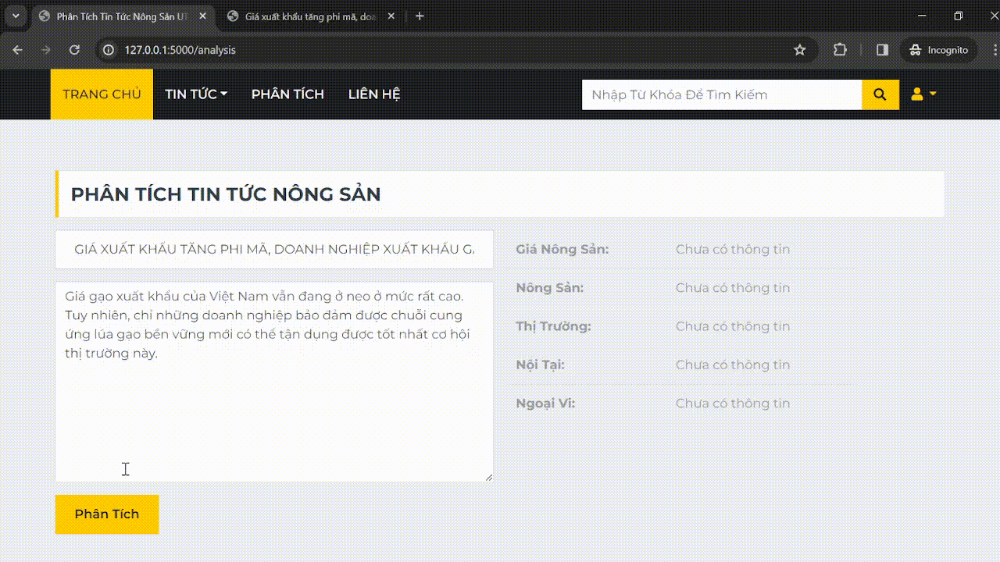

# Usage

1. Install package
```commandline
pip install -r requiremets.txt
```
2. Install Java 8 (or Higher)

3. Import data to database
- Create a mysql database with name "news"
- Run file `add2Databse.py` to add data to databse
```commandline
python3 .app/data/add2Database.py
```
4. Download trained model at [here]() and move to folder app/weights
5. Run flask app
```commandline
python3 main.py
```
## Result



